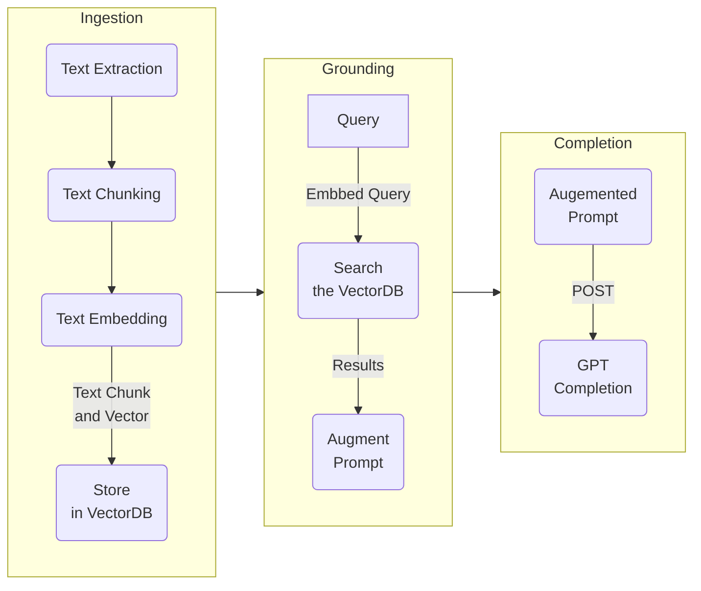

# A C# WebAPI minimal API<br/>RAG pattern multi-collection implementation

[Running and deploying this application](RUNME.md)

This repo includes a multi-collection RAG pattern implementation using C# minimal API and Semantic Kernel (SK). Through interfaces and configuration, SK supports different database connectors like Azure Search, PostgreSQL, Duck DB, Redis, volatile memory (a RAM DB), and others. As this implementation is multi-collection, each collection could represent different entities such as customers, business units, or areas.

There are areas of concern that need to be taken into consideration in RAG patterns such as:

- Ingestion
  - Managing the sources (text, PDFs, images, etc.).
  - Extracting the text from the sources.
  - Maybe keeping track of the source locations (to quote references).
- Text Chunking or smart chunking
  - Chunking large text sources into smaller pieces.
- Embedding and vector DB storage
  - Embedding the text chunks (basically, convert the text to a numerical vector representation)
  - Saving the chunks in a vector DB. In SK, the text and the text embedding are called a memory.
- Working with Token Limits
  - Token limitations in the LLM and embedding models.
- Processing Prompt and completions
  - Turning the query into an embedding
  - Comparing the query embedding against the vector DB embeddings returning the relevance scores and requested limits.
  - Using the text in the top relevant results to augment the prompt.
  - Sending the prompt for completion with the original query and the augmented context.

In SK, a memory is an object that includes among other things an ID (could be a URL to the original document), text (generally a text chunk), and a text embedding. This API allows you to ingest, recall, query, and delete SK memories.

## I. Diagram


## II. RAG Pattern Stages



### 1.0 Ingestion

Ingestion is the process of extracting the text from your source files, chunking, and vectorization the chunks, and saving the chunks to a vector database (sometimes this is called memorization).

#### 1.1 Text extraction

The project `ingestion` is a C# console application that will read the files in the `data/` folder, and read the text in all the text files.

<hr/>

**Note:** I kept this stage simple using only text files, but this process can be more complex by extracting text from different file types such as PDFs and Office files.

<hr/>

#### 1.2 Text chunking

After extracting the text, the `ingestion` console application, chunks the text using Semantic Kernel's text chunker. During this stage, the text is split into pieces that may span several paragraphs according to the requested size of the chunk. The size of the chunk is defined as a constant `Chunk_Size` in the `ingestion` application.

#### 1.3 Text vectorization and storage

During the final stage, the `ingestion` application sends a POST request to the server's `/api/gpt/memory` endpoint. This endpoint takes the chunk of text it has received, vectorizes the text using the OpenAI `ADA` endpoint, and finally stores the text chunk and vector in a vector database. 

<hr/>

**Important:**<br/><br/>It is important to understand that the prompt is augmented with the text chunks and not the vectors. The vectors are used to find the relevant chunks.<br/><br/>This application can work with multiple collections. A Collection can be a logical boundary for RAG resources. In other words, you could have RAG resources across companies like in a SaaS application, across OUs to separate content from different areas of a company, etc. Every API endpoint carries the `collection` parameter.

<hr/>

### 2.0 Grounding

During this stage, the user submits a query using the `frontend`. The `frontend`, in turn, sends a POST request to the server's `/api/gpt/query` endpoint. The API vectorizes the query and compares this vector against each chunk in the vector database. Those chunks having a high relevance are returned and used to augment the prompt together with the initial query. The POST query payload carries a response limit and minimum relevance helpful to more or less chunks with higher or lower relevance.

<hr/>

**[What is Grounding?](https://techcommunity.microsoft.com/t5/fasttrack-for-azure/grounding-llms/ba-p/3843857)** Grounding is the process of using large language models (LLMs) with information that is use-case specific, relevant, and not available as part of the LLM's trained knowledge.
<hr/>

### 3.0 Process the completion

The augmented prompt is submitted to the OpenAI GPT endpoint for completion, and finally, the results of the completion are rendered to the user in the `frontend`.

## II. Best practices

- Review the extracted text and apply cleanup and reformatting if necessary
- Use the playground to iterate over different prompts (prompt engineering)
- Take advantage of your model's token limits
  - Be mindful to include the completion tokens in this analysis
- Test different combinations of chunking logic and chunk sizes
  - A good starting point is 1024K tokens
- Involve SMEs in reviewing the recalled data against the queries
- Apply quality and RAI baselines to the expected results

## III. API Endpoints

The API allows for memories to be:

- Recalled by collection name and ID
- Insert by collection name and ID
- Queried
  - For the passed query, find the nearest results by relevance and count limit
  - Augment the prompt with the embedded text result
  - Process the completion of the query and embedded text results
- Deleted by collection name and ID

### 1.0 GET a memory - GET `/api/gpt/memory`

- Get a memory by collection and key.
- Parameters:
  - Collection Name
  - Memory ID

### 2.0 Create a memory - POST `/api/gpt/memory`

- Insert a memory by collection, key, and blob.
- Request Payload Model: Memory

### 3.0 DELETE a memory - `/api/gpt/memory`

- Delete a memory by collection and key.
- Request Payload Model: Memory

### 4.0 Query the database - POST - `/api/gpt/query`

- Find the nearest matches by query, relevance score, return limits, and token size.
- Request payload Model: Query
- Response payload Model: Completion

## IV. Server and API Payload Models

File: `src/backend/Models.cs`
```c#
record Memory(string collection, string key, string text);
record Query(string collection, string query, int maxTokens = 1000, int limit = 3, double minRelevanceScore = 0.77);
record Completion(string query, string text, object? usage, List<Citation>? learnMore = null);
record Citation(string collection, string doc);
```

<hr/>

**Memory:** A record representing a memory with attributes including the collection it belongs to, a unique key, and associated text.
Query: A record used for making queries, specifying the target collection, the query text, maximum token limits, result count limits, and minimum relevance score.
<hr/>
